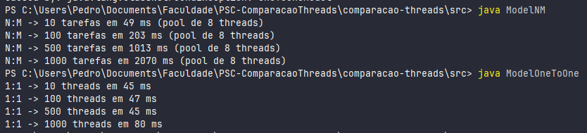

# Comparação de Desempenho entre Modelos de Threads N:M e 1:1

## Objetivo

Desenvolver dois programas em Java que simulem os modelos de execução de threads N:M e 1:1, e comparar o desempenho entre eles com base no tempo total de execução. O objetivo é compreender como o modelo de mapeamento de threads influencia a eficiência da execução concorrente.

## Métrica de avaliação

- Tempo total de execução (em milissegundos), medido do início ao fim da execução de todas as threads. 
- A comparação deve ser feita com diferentes quantidades de threads (ex: 10, 100, 500, 1000) para observar o impacto da escalabilidade.

### Preparação (Parte 1)
**Escolha da tarefa**: cada tarefa (`Task`) realiza:
- uma soma simples em um loop com número fixo de iterações, e
- um `Thread.sleep()` curto para simular I/O/espera.

**Parâmetros fixos**:
- número de iterações por tarefa (por exemplo, 1_000_000),
- tempo de `sleep` (por exemplo, 10 ms).
  Esses valores devem ser idênticos para ambos os modelos.

> O arquivo `Task.java` contém a implementação da tarefa usada nos testes.

### Simulação do modelo N:M (Parte 2)
Criar um pool fixo de threads do sistema usando `ExecutorService`:
   ```java
   ExecutorService executor = Executors.newFixedThreadPool(poolSize);
   ```
   No teste usamos `poolSize = 8`.
Submeter N tarefas ao pool (`executor.submit(new Task(i))`) para simular N threads de usuário multiplexadas em M threads do sistema.
Medir o tempo total:
   ```java
   long start = System.currentTimeMillis();
   long end = System.currentTimeMillis();
   long elapsed = end - start;
   ```

> Arquivo: `ModelNM.java` — implementa os passos acima e imprime o tempo total para cada N.

### Simulação do modelo 1:1 (Parte 3)
Criar N threads reais:
   ```java
   Thread t = new Thread(new Task(i));
   t.start();
   ```
Iniciar todas as threads quase simultaneamente e aguardar com `join()`:
   ```java
   for (Thread t : threads) t.join();
   ```
Medir o tempo total da mesma forma (`System.currentTimeMillis()` antes da criação/arranque e após todas `join()` terem retornado).

> Arquivo: `ModelOneToOne.java`.

### Execução dos testes (Parte 4 — comparação)
Execute ambos os programas para as quantidades de tarefas:
    - 10
    - 100
    - 500
    - 1000

Registre os tempos de execução em uma tabela (abaixo há a tabela com os resultados obtidos nos testes).

Analise os resultados: identifique onde cada modelo se torna mais vantajoso, levando em conta que o modelo N:M depende do número de threads do pool (M) e pode criar fila de espera quando N >> M.

Elabore relatório com tabela, gráficos comparativos e conclusões sobre o desempenho.

## Resultados (teste executado)
Os resultados obtidos nesta máquina:

| Nº de Threads | N:M (pool de 8 threads) | 1:1 (threads reais) |
|---------------:|------------------------:|--------------------:|
| 10             | 49 ms                   | 45 ms               |
| 100            | 203 ms                  | 47 ms               |
| 500            | 1013 ms                 | 45 ms               |
| 1000           | 2070 ms                 | 80 ms               |



## Observações sobre os resultados
- As tarefas usadas são relativamente leves; isso faz com que o custo de criar muitas threads seja baixo e o SO/JVM consiga gerenciar muitas threads curtas eficientemente.
- No modelo N:M, o pool de 8 threads forma uma fila quando N é grande, o que aumenta o tempo total.
- Em tarefas mais comlexas, se espera que o modelo N:M fosse mais otimizado.
- Para reduzir ruído nos resultados, recomenda-se executar cada caso 3 a 5 vezes e usar a média dos tempos.


